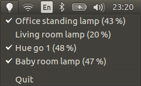

# fiou
A small [application indicator](https://unity.ubuntu.com/projects/appindicators/) to toggle [Philips Hue](http://meethue.com) lamps



You will need to install [phue](https://github.com/studioimaginaire/phue): 

```
pip install phue
```
Then edit `fiou.py` to change the IP address of your bridge. 

You will have to press the blue button on the bridge only the first time.
